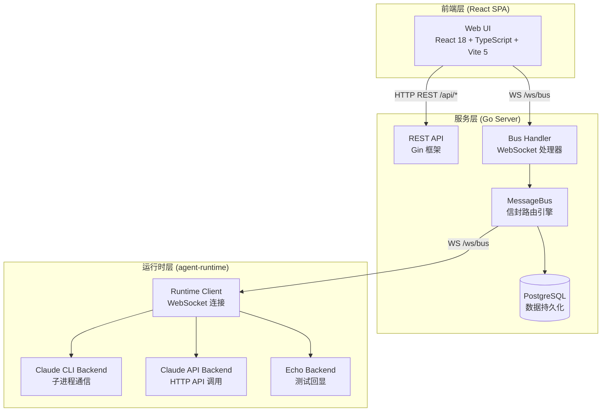
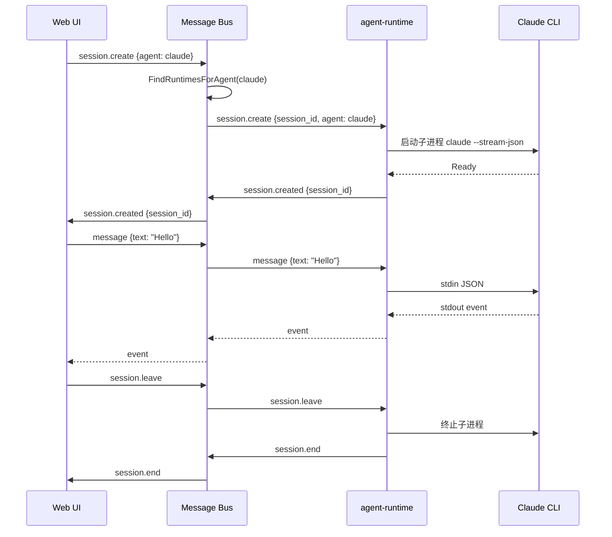
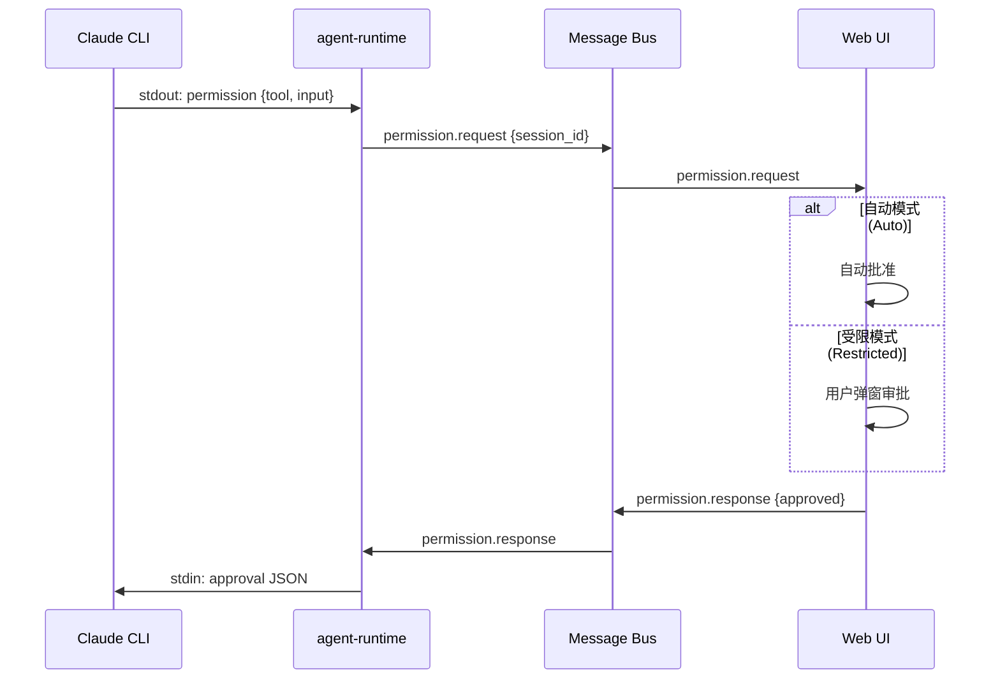
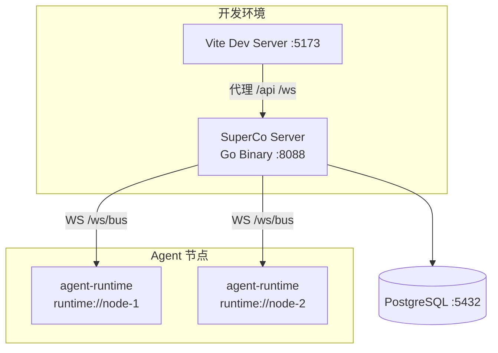

# SuperCo 技术架构 v1

> 版本: 2026-06-02
> 本文档描述 SuperCo 平台的核心技术架构、组件设计与数据流。

---

## 一、架构总览

SuperCo 采用 **中心化服务 + 分布式 Agent 运行时** 架构，通过统一的 Message Bus 实现组件间通信。



---

## 二、技术栈

| 层级 | 技术 | 说明 |
|------|------|------|
| **前端框架** | React 18 + TypeScript | 无外部状态库，纯 Hooks 管理 |
| **前端构建** | Vite 5 | 开发代理到 :8088 |
| **后端框架** | Go 1.26 + Gin v1.10 | REST 路由 |
| **WebSocket** | Gorilla WebSocket v1.5 | 消息总线传输层 |
| **数据库** | PostgreSQL + lib/pq | 自动迁移建表 |
| **认证** | golang-jwt v5 + bcrypt | JWT Bearer Token |
| **AI 后端** | Claude Code (stream-json) / Anthropic API | agent-runtime 子进程 |

---

## 三、核心设计

### 3.1 消息总线 (Message Bus)

Message Bus 是整个系统的通信中枢，采用 **信封协议 (Envelope Protocol)**：

```go
type Envelope struct {
    ID        string   // 消息唯一 ID
    From      string   // 源地址
    To        string   // 目标地址
    Type      string   // 消息类型
    SessionID string   // 所属会话 ID
    Payload   *Payload // 消息体
    Timestamp int64    // Unix 时间戳
    ReplyTo   string   // 回复地址（可选）
}
```

**地址系统：**

| 地址格式 | 说明 |
|----------|------|
| `ui://<user_id>/<conn_id>` | Web UI 客户端端点 |
| `runtime://<node_id>` | agent-runtime 实例端点 |
| `session://<session_id>` | 会话广播地址 |
| `system://bus` | 总线系统地址 |

**消息类型分类：**

| 类别 | 类型 |
|------|------|
| 系统 | hello, bye, ping, pong, ack, error |
| 会话生命周期 | session.create, session.created, session.join, session.joined, session.leave, session.end |
| 应用数据 | message, command, event, tool.use, tool.result |
| 权限 | permission.request, permission.response |

### 3.2 数据模型

系统包含五张核心表，服务端启动时自动迁移：

| 表名 | 核心字段 | 用途 |
|------|---------|------|
| **users** | id (UUID), username (UNIQUE), password (bcrypt), created_at | 用户账户 |
| **nodes** | id, user_id (FK), name, status, version, ip, last_seen | Agent 运行节点 |
| **sessions** | id, user_id (FK), node_id (FK), agent_id, status, prompt | 任务会话 |
| **agents** | id, node_id (FK), name, command, version, enabled | 节点能力 |
| **agent_profiles** | id (UUID), user_id (FK), name, avatar, description, agent_id, enabled | 用户智能体配置 |

### 3.3 智能体配置系统 (agent_profiles)

`agent_profiles` 表是用户级的智能体配置，与节点级的 `agents` 表分离：

```
users ──1:N──> agent_profiles
                  │
                  └── agent_id ────> 关联到 runtime 能力（如 claude, echo）
```

每个 profile 是用户对某个 runtime 能力的"包装"——用户可自定义名称、图标、描述。创建会话时通过 profile 的 `agent_id` 找到可用的 runtime 节点。

---

## 四、核心数据流

### 4.1 认证流程

```
用户 → POST /api/auth/login {username, password}
  → 服务端 bcrypt 验证密码
  → 返回 JWT Token + 用户信息
  → 前端存储到 localStorage
  → 后续请求携带 Authorization: Bearer <token>
```

### 4.2 会话生命周期



### 4.3 权限审批流程



---

## 五、前端架构

### 5.1 组件层级

```
App.tsx（认证 + 路由 + 编排）
├── LangProvider（国际化上下文）
├── Sidebar（侧边栏导航）
├── NodeList（节点列表页）
├── SessionList（会话列表页）
├── AgentList（智能体卡片页）
│   ├── AgentCard（智能体卡片）
│   ├── AgentCreateCard（创建卡片）
│   ├── AgentDetailModal（详情模态框）
│   └── AgentForm（创建表单模态框）
├── MessageStream（富消息渲染）
│   ├── TextBlock / CodeBlock / MarkdownBlock
│   ├── TableBlock / StatusBlock / ProgressBlock
│   ├── ToolUseBlock / ImageBlock / CardBlock
│   └── SeparatorBlock
├── InputArea（聊天输入框）
└── PermissionDialog（权限审批弹窗）
```

### 5.2 数据流

```
useDashboardWS（实时仪表盘）
  └── App.tsx 状态（nodes, sessions）
      └── NodeList / SessionList

useMessageBus（消息总线）
  └── App.tsx 状态（messages, sessionID）
      └── MessageStream / InputArea

api/client.ts（REST API）
  └── AgentList / Auth
```

### 5.3 React Hooks

| Hook | 连接 | 用途 |
|------|------|------|
| `useMessageBus` | `/ws/bus?type=ui` | 聊天消息实时通信 |
| `useDashboardWS` | `/ws/dashboard?token=jwt` | 节点/会话实时状态 |

### 5.4 国际化

简单的 key-value 翻译系统，通过 React Context 提供：
- 支持中文、英文
- 浏览器语言自动检测
- 偏好存储在 localStorage

---

## 六、后端架构

### 6.1 路由结构

**REST 路由：**

| 方法 | 路径 | 认证 | 说明 |
|------|------|------|------|
| POST | `/api/auth/login` | 无 | 用户登录 |
| POST | `/api/auth/register` | 无 | 用户注册 |
| GET | `/api/health` | 无 | 健康检查 |
| GET | `/api/nodes` | JWT | 节点列表 |
| POST | `/api/nodes/register` | JWT | 注册节点 |
| POST | `/api/nodes/heartbeat` | JWT | 节点心跳 |
| GET | `/api/agents/profiles` | JWT | 智能体列表 |
| POST | `/api/agents/profiles` | JWT | 创建智能体 |
| GET | `/api/agents/profiles/:id` | JWT | 智能体详情 |
| PUT | `/api/agents/profiles/:id` | JWT | 更新智能体 |
| DELETE | `/api/agents/profiles/:id` | JWT | 删除智能体 |
| GET | `/api/agents/runtimes` | JWT | 运行时列表 |
| POST | `/api/sessions` | JWT | 创建会话 |
| GET | `/api/sessions` | JWT | 会话列表 |

**WebSocket 路由：**

| 路径 | 用途 |
|------|------|
| `/ws/bus` | Message Bus 协议连接 |
| `/ws/dashboard` | 仪表盘实时广播 |

### 6.2 认证中间件

JWT Bearer Token 验证流程：
1. 从 `Authorization` 头提取 token
2. 解析并验证 JWT 签名
3. 提取 `user_id` 注入请求上下文
4. 处理器通过 `c.Get("user_id")` 获取

### 6.3 数据库自动迁移

服务端启动时自动执行 `InitDB()`：
- 检查并创建所有表的 `CREATE TABLE IF NOT EXISTS` 语句
- 创建必要的索引
- 无需手动执行 SQL 迁移脚本

---

## 七、部署架构



### 构建部署

```bash
# 编译服务端（跨平台）
cd server
GOOS=linux GOARCH=amd64 go build -o superco-server

# 编译 agent-runtime
cd agent-runtime
go build -o agent-runtime

# 前端构建
cd webui
npm run build  # 产物在 dist/
```

---

## 八、设计决策

### 8.1 为什么选择 Message Bus 而非直连？

| 方案 | 缺点 |
|------|------|
| UI 直连 Runtime | 需暴露多个端口，认证困难，无法持久化消息 |
| Message Bus 中转 | 统一路由、认证、消息持久化、广播能力 |

### 8.2 为什么不用 Redis？

| 方案 | 说明 |
|------|------|
| 旧版 | 使用 Redis 做任务队列，增加部署复杂度 |
| 当前 | Message Bus 内存路由 + PostgreSQL 持久化，简化架构 |

### 8.3 为什么智能体配置与节点分离？

| 表 | 职责 |
|------|------|
| `agents` | 节点级自动检测的能力记录，由 agent-runtime 心跳注册 |
| `agent_profiles` | 用户级自定义配置，关联 runtime 能力，支持命名和描述 |
