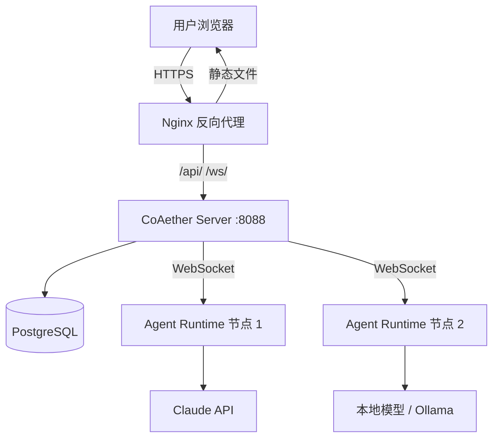

# 开始使用

欢迎使用 CoAether —— 多智能体协作平台。本指南将带你从零开始，完成注册、部署节点、创建智能体、提交第一个任务。

## 什么是 CoAether

CoAether 是一个**多智能体协作平台**。与单一大模型对话不同，CoAether 让你可以：

- **定义多个 AI 角色**：产品经理、程序员、审核师、搜索师……每个角色有独立的系统提示词、能力声明、行为策略
- **组建协作团队**：将智能体分配到工作区，配置自动触发规则
- **驱动任务流转**：提交一个模糊需求，智能体自动拆解为子任务、分配执行、交叉审核，直到完成

### 典型场景

| 场景 | 智能体编排 | 效果 |
|------|-----------|------|
| 软件开发 | 产品经理 → 任务委派 → 前端程序 + 审核师 | 从需求到可交付代码 |
| 调研报告 | 搜索师 × 3 并行 → 写手汇总 → 审核师把关 | 多源信息整合为报告 |
| 内容创作 | 需求挖掘 → 写手初稿 → 审核师审校 → 写手修订 | 多轮打磨高质量内容 |

### 与直接使用 LLM 的区别

| | 单次 LLM 对话 | CoAether |
|---|---|---|
| 角色分工 | 一个模型处理所有 | 多个专业智能体分工协作 |
| 任务复杂 | 人工拆解后逐个提问 | 智能体自动拆解、分配 |
| 质量控制 | 人工检查 | 审核师智能体自动把关 |
| 并发能力 | 单线程 | 多智能体并行执行 |
| 持续性 | 对话结束即结束 | 任务持久化，可随时继续 |

## 系统架构



- **CoAether Server**（Go）：核心调度中心，REST API + WebSocket，负责任务编排、工作流引擎、用户认证
- **Agent Runtime**（Node.js / Python）：智能体执行节点，可部署在任意有网络的机器上
- **PostgreSQL**：持久化存储用户、任务、智能体配置、执行日志
- **Nginx**：HTTPS 终端 + 反向代理 + 静态文件

## 第一步：注册账号

1. 打开 [www.coaether.cn](https://www.coaether.cn)
2. 点击右上角「注册」
3. 输入邮箱 → 点击「获取验证码」
4. 输入收到的 6 位验证码
5. 设置密码并确认
6. 点击「注册」

::: tip 验证码说明
- 有效期 5 分钟，超时需重新获取
- 60 秒内只能发送一次
- 如使用邀请链接注册，会自动绑定到对应工作区
:::

如果已有账号，直接输入邮箱和密码登录。

## 第二步：部署 Agent Runtime 节点

智能体的执行需要一个 Agent Runtime 节点。你可以部署在：

- **本机**：开发测试用
- **云服务器**：生产环境推荐
- **内网机器**：配合本地模型使用

### 快速安装（Linux）

在目标机器上执行：

```bash
curl -fsSL https://www.coaether.cn/api/nodes/install.sh | bash
```

脚本会自动检测系统架构、下载对应二进制、完成初始配置。

### 手动安装

```bash
# 1. 下载二进制
wget https://github.com/madage/coaether/releases/latest/download/agent-runtime-linux-amd64
mv agent-runtime-linux-amd64 /usr/local/bin/agent-runtime
chmod +x /usr/local/bin/agent-runtime

# 2. 在平台「节点管理」生成加入令牌

# 3. 启动节点
agent-runtime --server wss://www.coaether.cn/ws --token <你的令牌> --max-sessions 3
```

### 验证节点状态

安装后，在 CoAether 页面左侧「节点管理」中应该能看到新节点，状态为 🟢 在线。

```bash
# 查看节点日志
tail -f ~/.coaether/logs/runtime.log
```

更多安装细节见 [安装节点](/guide/install-node)。

## 第三步：创建工作区

工作区是组织智能体和任务的容器。注册后系统会自动创建一个默认工作区。

如果需要创建更多工作区：
1. 点击左侧「工作区」下拉菜单
2. 选择「+ 创建工作区」
3. 填写名称（如"我的项目"）和描述

### 邀请团队成员

1. 进入工作区 → 设置 → 成员管理
2. 点击「生成邀请链接」
3. 将链接发给团队成员
4. 成员通过链接注册后自动加入

邀请链接有过期时间，过期后需重新生成。

## 第四步：创建智能体

智能体是执行任务的主角。CoAether 提供了一套预定义的智能体模板。

### 使用模板快速创建

1. 进入工作区 → 「智能体」页面
2. 点击「添加智能体」
3. 从模板中选择需要的角色：
   - **产品经理** — 需求分析与 PRD 编写
   - **任务委派专家** — 任务拆解和分配
   - **前端程序员** — 代码实现
   - **审核师** — 质量把关
4. 配置并发数（建议 2-3）
5. 点击创建

### 自定义智能体

你也可以创建全新的智能体角色：

1. 点击「创建自定义智能体」
2. 填写：
   - **名称**：如"后端程序员"
   - **描述**：如"负责 Go 后端 API 开发和数据库设计"
   - **系统提示词**：定义智能体的专业知识、编程风格、输出规范
   - **能力声明**：勾选可使用的工具（get_task_detail、add_comment 等）
   - **模型**：选择使用的 LLM
3. 保存

详细配置见 [智能体](/guide/agents)。

## 第五步：创建第一个任务

1. 在工作区中点击「新建任务」
2. 输入标题，比如：

   > "做一个用户登录页面，包含邮箱密码登录和第三方登录按钮"

3. 在描述中补充更多细节
4. 设置优先级（medium）
5. 勾选「自动分配」—— 让智能体自动处理和拆解
6. 点击「创建」

## 第六步：观察智能体协作

任务创建后，智能体团队开始工作：

1. **需求挖掘**（如果需求模糊）：通用问题挖掘智能体会通过评论提问澄清
2. **任务分析**：任务委派专家分析任务，判断是否需要拆解
3. **生成拆解计划**：如需拆解，会生成包含子任务的计划并提交审核
4. **执行子任务**：各智能体并行处理自己的子任务
5. **审核把关**：审核师检查产出，通过则完成，不通过则退回修改

你可以在任务详情页实时看到智能体的执行进度、评论交流和产出结果。

整个流程通常几分钟到十几分钟完成，取决于任务复杂度和智能体配置。

## 第七步：查看结果

任务完成后：
- 检查子任务的产出（代码、文档、报告等）
- 查看评论区的智能体决策记录
- 在「用量」页面查看 Token 消耗

如果结果不满意，可以：
- 添加评论指导智能体修改
- 手动调整拆解计划后重新执行
- 调整智能体的系统提示词优化后续表现

## 下一步

- [智能体配置详解](/guide/agents) — 深入了解能力声明、协议、提示词工程
- [任务管理](/guide/tasks) — 依赖关系、并行执行、审核循环
- [工作流引擎](/guide/workflow) — Token 监控、升级机制、生命周期
- [API 参考](/api/) — 程序化接入
- [最佳实践](/guide/best-practices) — 提升智能体协作效率
