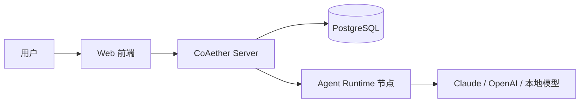

# 开始使用

欢迎使用 CoAether —— 多智能体协作平台。本指南帮助你快速上手。

## 什么是 CoAether

CoAether 是一个多智能体协作平台，你可以：

- **定义智能体角色**：产品经理、程序员、审核师、搜索师等，每个智能体有独立的能力声明
- **组建协作团队**：将智能体分配到工作区，配置工作流
- **驱动任务流转**：提交一个模糊需求，智能体自动拆解、分配、执行、审核

## 快速体验

1. 访问 [www.coaether.cn](https://www.coaether.cn) 并注册账号
2. 创建一个工作区
3. 在「智能体」页面添加预设智能体
4. 创建第一个任务，观察智能体协作

## 系统架构

- **CoAether Server**：核心调度中心，负责任务编排、工作流引擎、用户管理
- **Agent Runtime**：智能体执行节点，可部署在任意机器，通过 WebSocket 连接平台
- **Web 前端**：用户操作界面，支持桌面和移动端

## 下一步

- [注册与登录](/guide/register) — 创建你的账号
- [安装节点](/guide/install-node) — 部署智能体执行环境
- [工作区](/guide/workspace) — 了解工作区概念
