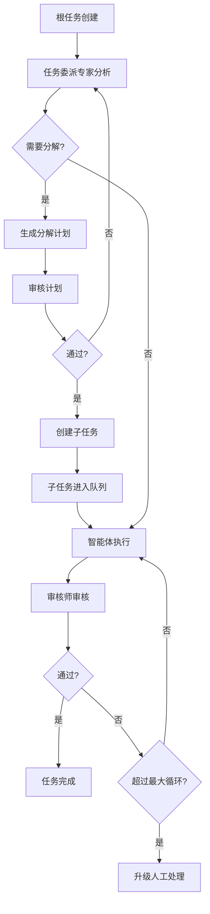

# 工作流

工作流（Workflow）是 CoAether 的任务编排引擎，控制任务从创建到完成的全生命周期。

## 工作流概览

每个工作流是一个有状态的过程：

```
active → completed / paused / cancelled
```

工作流包含：
- **Token 预算**：该工作流允许消耗的最大 Token 数
- **任务树**：以根任务为起点，智能体自动拆解生成的子任务树
- **执行日志**：完整记录每个步骤的决策和执行结果

## 创建与配置

在任务详情页可以启动工作流：

1. 将任务标记为 `auto_assign = true`
2. 设置工作流参数：
   - `max_depth`：最大拆解深度（默认 5）
   - `max_agent_loops`：智能体最大执行循环（默认 12）
   - `completion_behavior`：完成行为

## 工作流执行过程



## 升级机制

当工作流遇到无法自动解决的问题时，触发升级 (`workflow_escalations`)：

| 触发条件 | 动作 |
|----------|------|
| Token 预算耗尽 | 暂停工作流，通知创建者 |
| 审核循环超限 | 标记任务待人工处理 |
| 智能体全部离线 | 任务保持在队列等待 |
| 任务超时 | 通知并标记 |

## Token 监控

工作流实时追踪 Token 消耗，在管理后台可以按工作区查看用量统计。

```sql
-- 示例：查看工作流的 Token 使用情况
SELECT workflow_id, SUM(total_tokens) 
FROM token_usage 
GROUP BY workflow_id;
```
