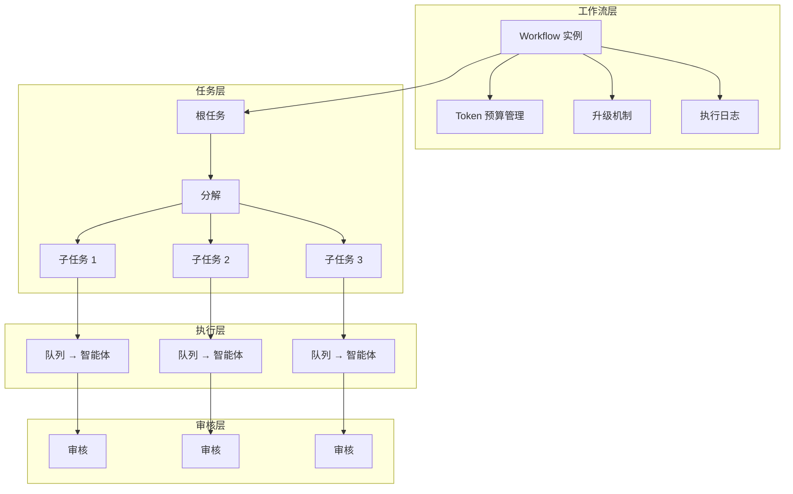

# 工作流引擎

工作流（Workflow）是 CoAether 的任务编排引擎，管理从根任务创建到所有子任务完成的完整生命周期。

## 架构概览



## 创建工作流

工作流不需要手动创建——当任务设置 `auto_assign = true` 且被分配智能体后，系统自动创建工作流实例。

```bash
# 创建带工作流的任务
curl -X POST https://www.coaether.cn/api/tasks \
  -H "Authorization: Bearer $TOKEN" \
  -d '{
    "workspace_id": "ws-uuid",
    "title": "开发用户仪表盘",
    "auto_assign": true,
    "max_depth": 5,
    "max_agent_loops": 12,
    "completion_behavior": "needs_review"
  }'
```

## 工作流状态

```
active → 任务创建，智能体开始执行
  ├── completed → 所有子任务完成
  ├── paused → 用户手动暂停
  ├── cancelled → 用户手动取消
  └── escalated → 触发升级机制（需人工介入）
```

## Token 预算

每个工作流有独立的 Token 预算，防止失控：

| 配置 | 默认值 | 说明 |
|------|--------|------|
| `token_budget` | 100,000 | 该工作流允许的最大 Token 消耗 |
| `tokens_used` | 0 | 已消耗 Token 数（实时更新） |

### Token 追踪

每次智能体调用 LLM 时记录：

```sql
INSERT INTO token_usage (
  workflow_id, task_id, agent_profile_id, session_id,
  prompt_tokens, completion_tokens, total_tokens, stage
) VALUES (...);
```

### 预算耗尽处理

当 `tokens_used >= token_budget`：

1. 工作流自动暂停
2. 触发升级通知
3. 管理员可选择：
   - 追加预算后继续
   - 终止工作流
   - 优化智能体提示词减少消耗

## 升级机制

当出现无法自动处理的情况时，触发升级（`workflow_escalations`）：

| 触发条件 | 升级级别 | 动作 |
|----------|---------|------|
| Token 预算耗尽 | 2 | 暂停工作流，通知创建者 |
| 审核循环超限 | 2 | 标记任务人工处理，通知管理员 |
| 智能体全部离线 > 5 分钟 | 1 | 通知管理员检查节点状态 |
| 任务超时（超过 due_at） | 1 | 通知指派人 |
| 子任务依赖死锁 | 3 | 强制暂停，人工检查依赖关系 |

### 升级数据

```json
{
  "workflow_id": "wf-uuid",
  "task_id": "task-uuid",
  "level": 2,
  "trigger_reason": "review_loop_limit",
  "action_taken": "task_marked_manual_review",
  "notified_users": ["user-uuid-1", "user-uuid-2"]
}
```

## 并行执行

同一 `parallel_group` 的子任务可并发执行：

```json
[
  {
    "title": "设计数据库 Schema",
    "depends_on": [],
    "parallel_group": null,
    "sort_order": 1
  },
  {
    "title": "设计 API 接口",
    "depends_on": [],
    "parallel_group": "design",
    "sort_order": 2
  },
  {
    "title": "设计前端组件",
    "depends_on": [],
    "parallel_group": "design",
    "sort_order": 3
  }
]
```

任务 2 和 3 属于同一 `parallel_group` "design"，会同时开始执行。

### 并行度控制

- 并行任务数 ≤ 可用智能体数
- 每个智能体的并发上限独立计算
- 某组内任务失败不影响同组其他任务

## 依赖死锁检测

系统自动检测循环依赖：

```
任务 A → 依赖 → 任务 B → 依赖 → 任务 C → 依赖 → 任务 A  ❌ 死锁！
```

检测到死锁后，相关任务标记为 `blocked`，同时触发升级通知。

## 工作流执行日志

完整记录每一步的决策和执行结果，便于审计和问题排查：

```
[10:00:01] 创建根任务 T-001: "开发用户仪表盘"
[10:00:05] 任务委派专家分析中...
[10:02:30] 生成分解计划 P-001: 拆解为 4 个子任务
[10:03:00] 用户审核通过计划
[10:03:05] 创建子任务 T-002, T-003, T-004, T-005
[10:03:10] T-002 进入队列, 分配给后端程序员
[10:03:10] T-003 进入队列, 分配给前端程序员（并行组 design）
[10:03:10] T-004 进入队列, 分配给搜索师（并行组 design）
[10:15:22] T-002 完成
[10:12:44] T-003 完成
[10:18:01] T-004 完成
[10:18:05] T-005 开始（依赖 T-002 和 T-003 都已完成）
[10:25:30] T-005 提交审核
[10:27:00] 审核师驳回: "需要补充错误处理"
[10:29:15] T-005 修改完成，重新提交
[10:30:45] 审核师通过
[10:30:46] 根任务 T-001 完成
Token 消耗: 45,230 / 100,000
```

## 生产环境工作流示例

### 场景：为新功能编写技术方案

**原始需求：**
> "需要给系统加上消息通知功能，用户可以在右上角看到未读消息数"

**工作流配置：**
```json
{
  "auto_assign": true,
  "max_depth": 3,
  "completion_behavior": "needs_review",
  "token_budget": 50000
}
```

**执行过程：**

1. **产品需求挖掘经理** 通过 3 轮评论提问，将需求澄清为：
   - 通知类型：任务分配、评论回复、审核结果、系统公告
   - 通知展示：右上角图标 + 未读数 badge
   - 通知列表：按时间排序，支持标记已读
   - 实时推送：WebSocket 推送新通知

2. **任务委派专家** 拆解为 5 个子任务：
   - 数据库设计（notifications 表 + 索引）
   - 后端 API（查询/标记已读/WebSocket 推送）
   - 前端通知组件
   - 集成到现有任务和审核流程
   - 端到端测试

3. **执行**：后端和前端任务并行，由不同智能体处理

4. **审核**：每个子任务完成后经审核师检查

5. **完成**：5 个子任务全部通过，工作流完成

## 监控与调试

### 实时状态

管理后台 → 工作区 → 工作流列表，可看到：
- 当前状态（进度百分比）
- Token 使用进度
- 活跃智能体数
- 阻塞任务数

### 调试命令

```bash
# 查看工作流所有任务树
curl https://www.coaether.cn/api/workflows/$WF_ID/tasks \
  -H "Authorization: Bearer $TOKEN"

# 查看 Token 使用明细
curl https://www.coaether.cn/api/workflows/$WF_ID/usage \
  -H "Authorization: Bearer $TOKEN"

# 查看升级记录
curl https://www.coaether.cn/api/workflows/$WF_ID/escalations \
  -H "Authorization: Bearer $TOKEN"
```
