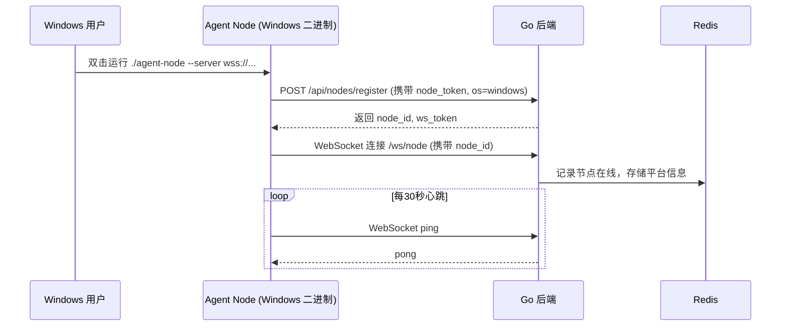
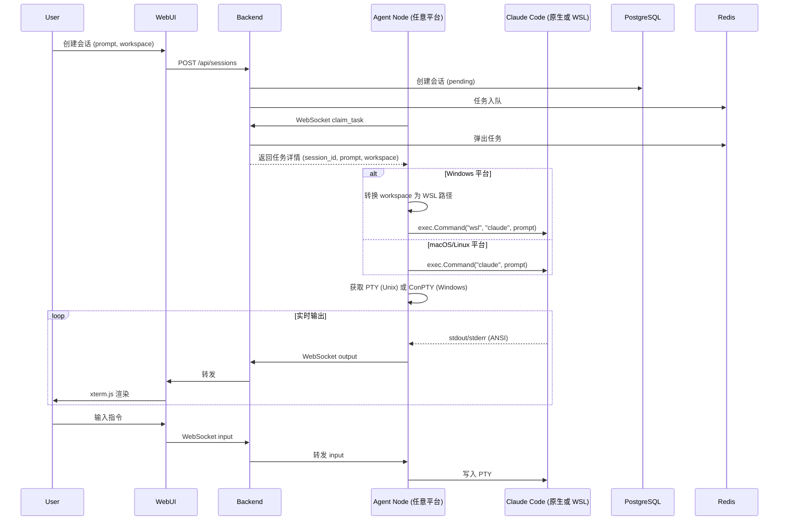

# MVP 完整方案：跨平台 AI Agent 分布式调度平台（无 Docker，支持 Mac / Windows / Linux）

本方案基于之前“MVP 阶段：无 Docker 的轻量部署（Mac 版）”进行扩展，核心改进是将 **Agent Node 设计为跨平台二进制文件**（通过 Go 交叉编译），从而让同一套后端可以在 **macOS、Windows、Linux** 上统一调度 Agent Node，且保留 Claude Code 的完整能力。

---

## 一、总体技术架构（跨平台版）

| 层级 | 技术选型 | 部署位置 | 说明 |
|------|----------|----------|------|
| **Web UI** | React + TypeScript + Vite + xterm.js | 开发机或服务器 | 提供终端界面，实时显示 Agent 输出 |
| **后端服务** | Go 1.21 + Gin + WebSocket | 服务器（Mac/Linux VM） | 单体服务，提供 REST API 和 WebSocket |
| **数据库** | PostgreSQL 15 | 服务器（或云托管） | 存储用户、节点、会话元数据 |
| **缓存/队列** | Redis 7 | 服务器（或云托管） | 在线节点、会话状态、任务队列 |
| **Agent Node** | **Go 交叉编译的二进制**（支持 macOS/Windows/Linux） | 用户本地机器 | 独立运行，通过 WebSocket 与后端通信，负责 PTY 启动 Claude Code |
| **Claude Code** | 官方 CLI | 用户本地（Windows 需 WSL） | 由 Agent Node 调用，保留全部能力（MCP、子 Agent、记忆等） |

### 核心特性
- ✅ 后端统一：一套 Go 后端服务，无需改动即可对接不同平台的 Agent Node。
- ✅ Agent Node 跨平台：同一份 Go 源代码，交叉编译出 macOS、Linux、Windows 三个平台的二进制文件。
- ✅ 用户侧零依赖：用户只需下载对应平台的二进制文件，无需安装 Go、Docker 等。
- ✅ 保留 Claude Code 完整能力：通过 PTY（Unix）或 ConPTY（Windows）启动 Claude Code，不降级为 JSON 流模式。
- ✅ 支持会话暂停/恢复（同节点）：Unix 使用 SIGSTOP/SIGCONT，Windows 使用 SuspendThread/ResumeThread 或依赖 WSL 的信号转发。

---

## 二、跨平台 Agent Node 的设计要点

### 2.1 统一接口，平台特化实现

Agent Node 对外（后端）暴露相同的 WebSocket 消息协议，内部通过 Go 的条件编译 (`//go:build`) 为不同平台实现差异部分。

| 功能 | macOS/Linux 实现 | Windows 实现 |
|------|------------------|---------------|
| 伪终端 (PTY) | `github.com/creack/pty` | `github.com/aymanbagabas/go-pty` (基于 ConPTY) |
| 启动 Claude Code | 直接执行 `claude` 命令 | 通过 `wsl` 调用 WSL 内的 `claude`（推荐）或使用第三方原生方案 |
| 进程暂停 | `syscall.SIGSTOP` | `SuspendThread` 遍历进程线程（或依赖 WSL 发送信号） |
| 进程恢复 | `syscall.SIGCONT` | `ResumeThread` |
| 工作区路径 | 直接使用绝对路径 | 转换为 WSL 内部路径（如 `C:\work` → `/mnt/c/work`） |

### 2.2 构建跨平台二进制

在 CI 或本地使用 Makefile 批量编译：

```makefile
.PHONY: build-all
build-all:
    # macOS (Intel & Apple Silicon)
    GOOS=darwin GOARCH=amd64 go build -o builds/agent-node-darwin-amd64
    GOOS=darwin GOARCH=arm64 go build -o builds/agent-node-darwin-arm64
    # Linux
    GOOS=linux GOARCH=amd64 go build -o builds/agent-node-linux-amd64
    # Windows
    GOOS=windows GOARCH=amd64 go build -o builds/agent-node-windows-amd64.exe
```

用户下载对应文件后，赋予执行权限（macOS/Linux）或直接双击运行（Windows 命令行）。

### 2.3 Windows 用户的额外要求

由于 Claude Code 本身需要 Node.js 且依赖 Unix-like 环境，Windows 用户需要：
- 安装 **WSL2** 并配置一个 Linux 发行版（如 Ubuntu）
- 在 WSL 内安装 Node.js 和 Claude Code
- Agent Node 通过 `wsl -d Ubuntu claude` 命令调用

Agent Node 内部会自动检测操作系统，若为 Windows，则使用 `exec.Command("wsl", args...)` 启动 Claude Code，并处理好路径转换。

---

## 三、完整系统架构图（跨平台）

```mermaid
graph TB
    subgraph "服务器端 (macOS / Linux VM)"
        Backend[Go 后端 :8080]
        PostgreSQL[(PostgreSQL)]
        Redis[(Redis)]
    end

    subgraph "用户端 (macOS)"
        NodeMac[Agent Node 二进制]
        ClaudeMac[Claude Code 原生]
    end

    subgraph "用户端 (Windows)"
        NodeWin[Agent Node 二进制 .exe]
        WSL[WSL2 环境]
        ClaudeWin[Claude Code 在 WSL 内]
    end

    WebUI[Web UI (React)] -->|HTTP / WebSocket| Backend
    Backend --> PostgreSQL
    Backend --> Redis

    Backend <-->|WebSocket| NodeMac
    NodeMac -->|PTY| ClaudeMac

    Backend <-->|WebSocket| NodeWin
    NodeWin -->|wsl 调用| WSL
    WSL --> ClaudeWin
```

---

## 四、核心流程图（仅展示跨平台相关的节点注册与任务执行）

### 4.1 节点注册（以 Windows Agent Node 为例）



### 4.2 任务分发与执行（跨平台差异在 Agent Node 内部封装）



---

## 五、部署与使用步骤（完整 MVP）

### 5.1 服务器端（以 Mac 为例）

```bash
# 1. 安装 PostgreSQL 和 Redis
brew install postgresql redis
brew services start postgresql
brew services start redis

# 2. 创建数据库
createdb myai
psql -d myai -c "CREATE USER myai WITH PASSWORD 'myai123';"
psql -d myai -c "GRANT ALL PRIVILEGES ON DATABASE myai TO myai;"

# 3. 编译后端
cd backend
go build -o myai-server
./myai-server

# 4. 启动前端 (开发模式)
cd ../frontend
npm install
npm run dev   # 监听 localhost:5173
```

### 5.2 用户端（macOS 为例）

```bash
# 下载 agent-node-darwin-amd64 并赋予执行权限
chmod +x agent-node-darwin-amd64
# 运行
./agent-node-darwin-amd64 --server ws://your-server-ip:8080/ws/node --token <user_jwt>
```

### 5.3 用户端（Windows 为例）

1. 安装 WSL2 并配置 Ubuntu，在 WSL 内安装 Node.js 和 Claude Code。
2. 下载 `agent-node-windows-amd64.exe`。
3. 打开 PowerShell 或 CMD，运行：
   ```cmd
   agent-node-windows-amd64.exe --server ws://your-server-ip:8080/ws/node --token <user_jwt>
   ```

---

## 六、MVP 功能清单与跨平台支持矩阵

| 功能 | macOS | Linux | Windows (WSL) |
|------|-------|-------|----------------|
| Agent Node 注册/心跳 | ✅ | ✅ | ✅ |
| 创建会话，启动 Claude Code | ✅ | ✅ | ✅（通过 wsl 调用） |
| 实时终端输出（ANSI） | ✅ | ✅ | ✅ |
| 用户输入指令 | ✅ | ✅ | ✅ |
| Ctrl+C 中断 | ✅ | ✅ | ✅（需转发信号） |
| 会话暂停/恢复（同节点） | ✅ | ✅ | ✅（依赖 WSL 信号或线程暂停） |
| 工作区文件持久化 | ✅ | ✅ | ✅（路径映射） |

---

## 七、总结

**最终 MVP 方案的核心特点**：
- 后端单一 Go 服务，无 Docker，可运行在 Mac/Linux 服务器。
- Agent Node 通过 Go 交叉编译为 macOS、Linux、Windows 三个平台的独立二进制文件。
- Windows 用户借助 WSL 运行 Claude Code，Agent Node 负责路径转换和进程调用。
- 全部保留了 Claude Code 的原生能力（PTY 模式、MCP、子 Agent、记忆）。
- 用户使用简单：下载二进制 → 运行 → 自动注册到后端。

该方案既可以快速在 Mac 上本地开发测试，也可以立即支持 Windows 用户的接入，为后续商业化（SaaS 多租户）打下坚实基础。