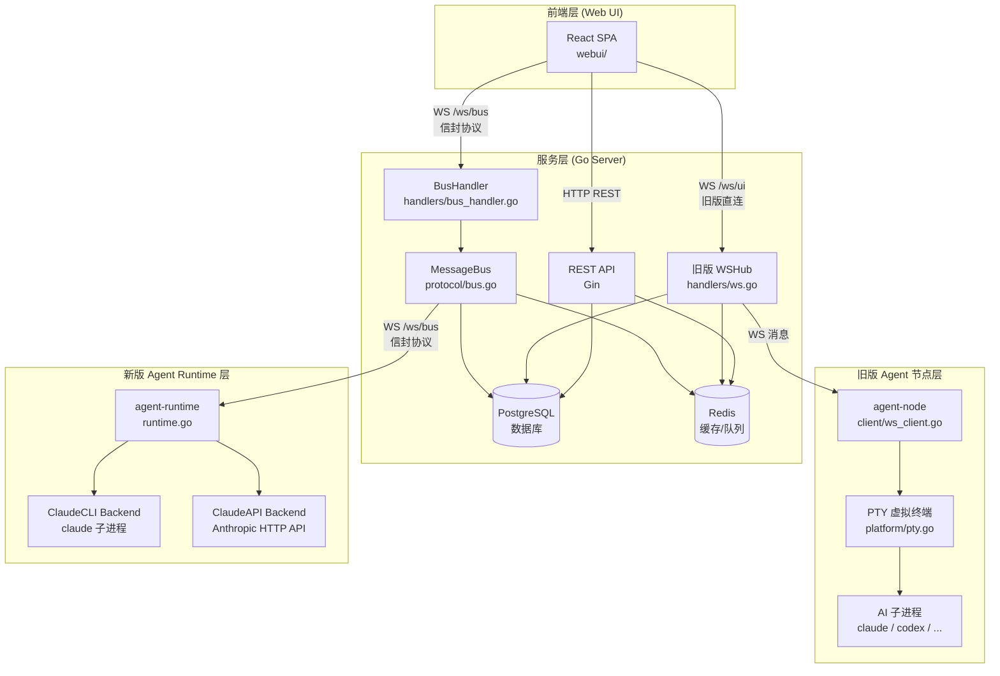
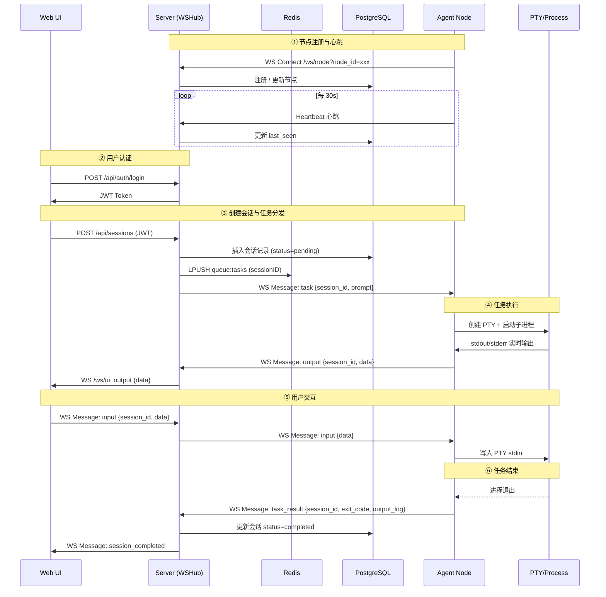
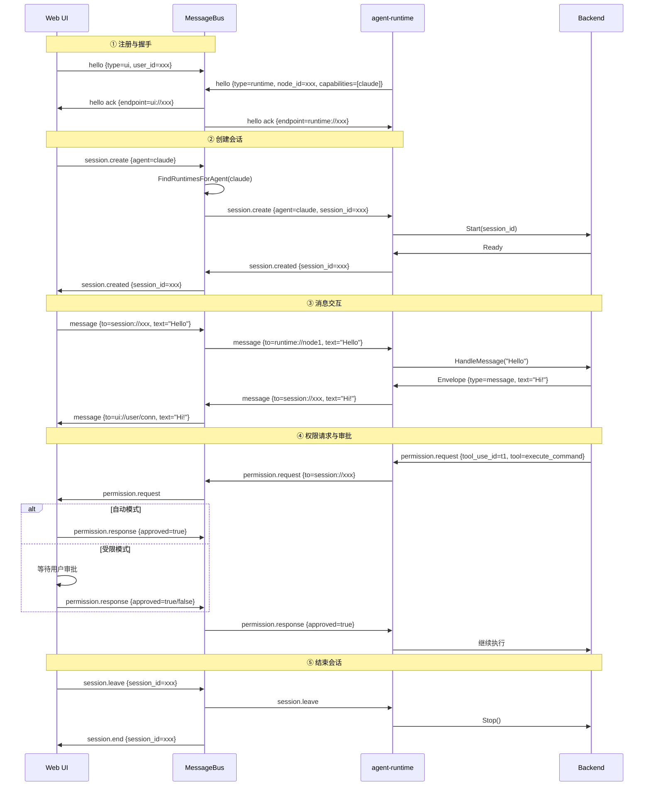
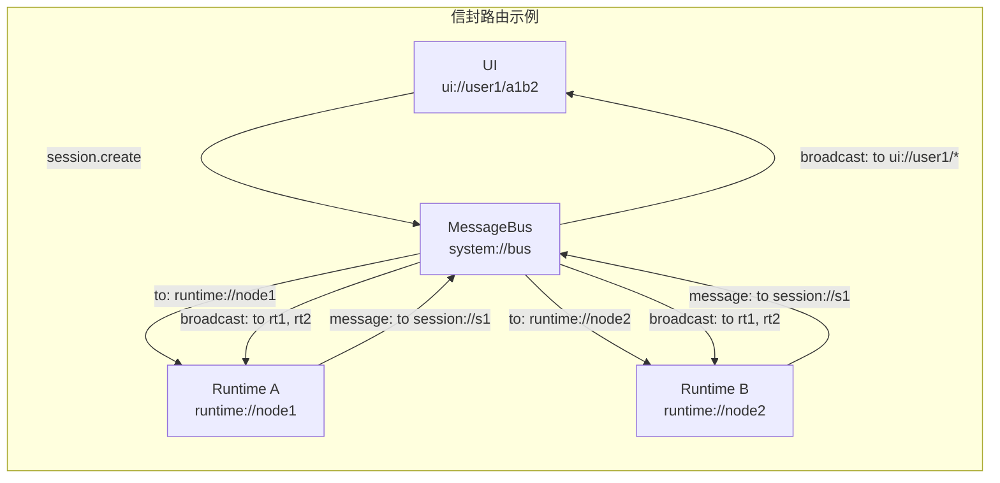
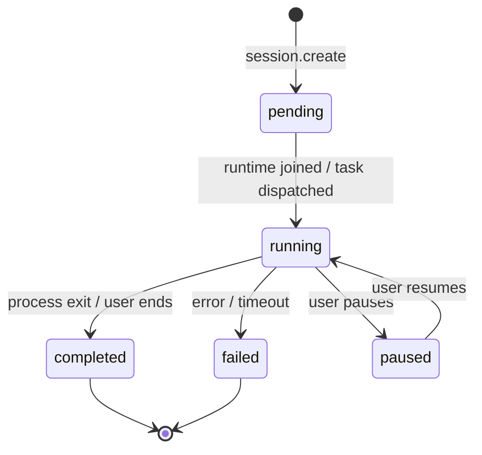
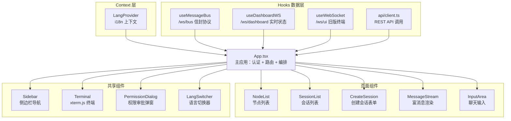
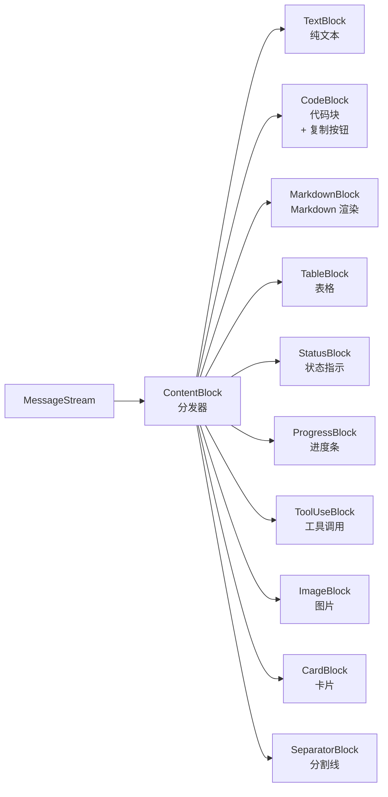
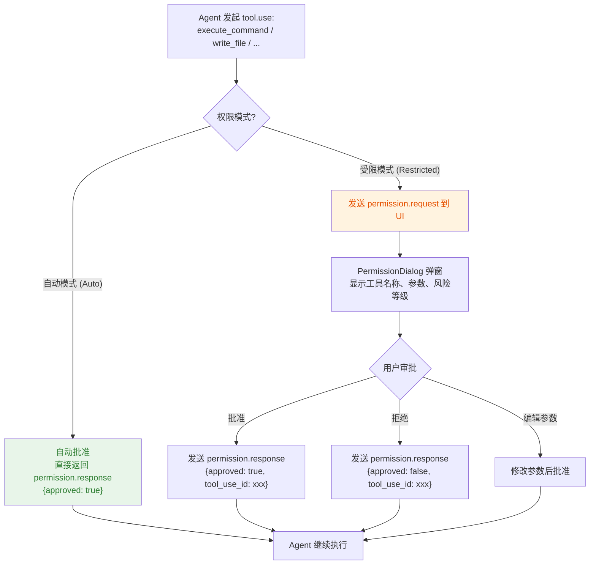
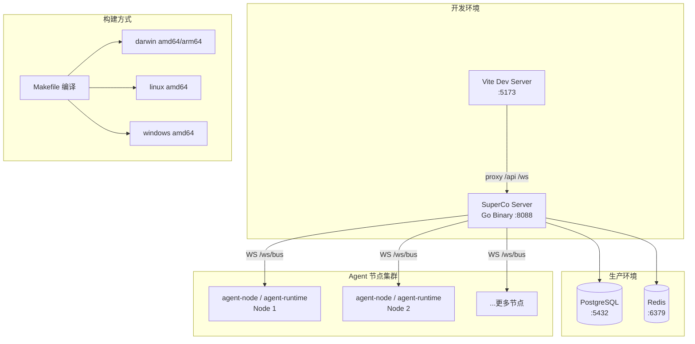

# SuperCo 技术架构全景

> 版本: 2026-06-01  
> 本文档描述 SuperCo 项目的整体技术架构、模块划分与核心数据流。

---

## 一、项目概述

SuperCo 是一个**分布式 AI Agent 调度平台**，核心能力是管理多台运行 AI 工具（如 Claude Code）的机器节点，通过统一的 Web 界面或消息总线协议来创建会话、调度任务、实时交互。

项目采用 **Go + React** 技术栈，代码库包含两套并存的通信架构：

| 架构 | 状态 | 说明 |
|------|------|------|
| 旧版 (agent-node) | 稳定运行 | 直连 WebSocket + PTY，每个会话一条独立连接 |
| 新版 (agent-runtime + Message Bus) | 战略方向 | 信封协议 + 发布/订阅总线，支持多后端、结构化消息 |

### 系统总体架构图



---

## 二、技术栈

| 层级 | 技术 |
|------|------|
| **前端** | React 18, TypeScript, Vite 5, xterm.js 5 |
| **后端服务** | Go 1.21, Gin v1.10 (HTTP 路由), Gorilla WebSocket v1.5 |
| **旧版 Agent 节点** | Go 1.21, Gorilla WebSocket, creack/pty |
| **新版 Agent Runtime** | Go 1.23, Gorilla WebSocket, 与服务端共用协议层 |
| **数据库** | PostgreSQL (via lib/pq) |
| **缓存/队列** | Redis (via go-redis v9) |
| **认证** | JWT (via golang-jwt v5) + bcrypt |
| **Agent CLI** | Claude Code (`stream-json` 协议), Anthropic Messages API |

---

## 三、项目目录结构

```
superco/
├── server/                  # Go 后端 —— 中央枢纽
│   ├── main.go              # 入口，组装所有模块
│   ├── config/config.go     # 环境变量加载
│   ├── database/database.go # PostgreSQL 连接 + 自动建表
│   ├── redis/redis.go       # Redis 客户端（节点追踪、任务队列、会话映射）
│   ├── middleware/auth.go   # JWT Bearer 中间件
│   ├── models/              # 数据模型
│   ├── handlers/            # HTTP + WebSocket 处理器
│   │   ├── auth.go          # 登录/注册
│   │   ├── node.go          # 节点 CRUD、Agent 列表、心跳
│   │   ├── session.go       # 会话 CRUD、任务分发
│   │   ├── ws.go            # 旧版 WSHub（节点/UI/仪表盘连接）
│   │   └── bus_handler.go   # 新版 Message Bus WebSocket 处理器
│   └── protocol/            # 消息总线协议（与 agent-runtime 共享）
│       ├── address.go       # 地址解析（ui://, runtime://, session://, system://）
│       ├── message.go       # Envelope 定义与消息类型常量
│       └── bus.go           # MessageBus 路由引擎
│
├── agent-node/              # 旧版 Agent 节点
│   ├── main.go              # 入口，通过 WebSocket 连接服务端
│   ├── client/ws_client.go  # WebSocket 客户端：连接、心跳、PTY 任务执行
│   ├── client/scanner.go    # PATH 扫描（发现 claude, openclaw, codex, hermes）
│   └── platform/            # 跨平台 PTY 抽象
│       ├── pty.go           # PTY 接口
│       ├── pty_unix.go      # Unix 实现（creack/pty）
│       └── pty_windows.go   # Windows 实现（kernel32）
│
├── agent-runtime/           # 新版 Runtime —— 通过 Message Bus 连接
│   ├── runtime.go           # Runtime 主结构，连接 /ws/bus，管理 Backend
│   ├── backends/
│   │   ├── echo.go          # 测试用 EchoBackend
│   │   ├── claude.go        # ClaudeBackend —— Anthropic Messages API (HTTP)
│   │   └── claude_cli.go    # ClaudeCLIBackend —— claude 子进程 (stream-json)
│   └── cmd/pty_int/main.go  # PTY 集成测试
│
├── webui/                   # React 前端
│   ├── src/
│   │   ├── main.tsx         # React 入口
│   │   ├── App.tsx          # 主应用：认证、路由、Message Bus 集成
│   │   ├── types/index.ts   # TypeScript 接口定义
│   │   ├── api/client.ts    # REST API 客户端
│   │   ├── hooks/
│   │   │   ├── useMessageBus.ts    # 新版：Message Bus 连接 (envelope 协议)
│   │   │   ├── useWebSocket.ts     # 旧版：直接会话 WebSocket
│   │   │   └── useDashboardWS.ts   # 仪表盘实时更新 WebSocket
│   │   ├── components/
│   │   │   ├── MessageStream.tsx    # 富消息渲染（文本/代码/表格/进度/tool_use）
│   │   │   ├── InputArea.tsx        # 聊天输入（含权限响应）
│   │   │   ├── Terminal.tsx         # xterm.js 终端组件
│   │   │   ├── NodeList.tsx         # 节点列表
│   │   │   ├── SessionList.tsx      # 会话列表
│   │   │   ├── CreateSession.tsx    # 创建会话表单
│   │   │   ├── PermissionDialog.tsx # 权限请求弹窗
│   │   │   └── LangSwitcher.tsx     # 语言切换
│   │   └── i18n/                    # 国际化
│   │       ├── context.tsx          # LangProvider + useLang
│   │       ├── en.ts                # 英文翻译
│   │       └── zh.ts                # 中文翻译
│   └── vite.config.ts               # Vite 配置（代理 /api、/ws 到 :8088）
│
├── docs/
│   └── claude-code-stream-json-protocol.md  # Claude CLI stream-json 协议文档
│
└── 技术文档/                # 技术文档
    ├── Agent Runtime 架构设计.md
    ├── SuperCo 平台技术架构报告.md
    └── SuperCo 技术架构全景.md        # ← 本文
```

---

## 四、数据库设计

四张表，服务端启动时自动迁移（`database/database.go`）：

| 表 | 主要字段 | 用途 |
|----|---------|------|
| **users** | id (UUID), username (unique), password (bcrypt), created_at | 用户账户 |
| **nodes** | id, user_id (FK), name, os, arch, status (online/offline/busy), version, ip, max_sessions (default 3), last_seen | Agent 运行节点 |
| **sessions** | id, user_id (FK), node_id (FK), agent_id, status (pending/running/paused/completed/failed), prompt, workspace, output_log, error_log, pid | 任务会话 |
| **agents** | id, node_id (FK), name, command, version, enabled, auto_detected | 节点上可用的 AI 工具 |

---

## 五、Redis 用途

| 用途 | 操作 |
|------|------|
| 在线节点追踪 | `HSet("nodes:online", nodeID, data)` / `HGetAll` |
| 任务队列 | `LPush("queue:tasks", sessionID)` / `BRPop` |
| 会话-节点映射 | `Set("session:<id>:node", nodeID)` |
| 会话状态 | `Set("session:<id>:status", status)` |

---

## 六、API 概览

### REST 接口

| 方法 | 路径 | 认证 | 说明 |
|------|------|------|------|
| POST | `/api/auth/login` | 无 | 登录 |
| POST | `/api/auth/register` | 无 | 注册 |
| GET | `/api/health` | 无 | 健康检查 |
| GET | `/api/nodes` | JWT | 节点列表 |
| POST | `/api/nodes/register` | JWT | 注册节点 |
| POST | `/api/nodes/heartbeat` | JWT | 节点心跳 |
| GET | `/api/nodes/:id/agents` | JWT | 节点 Agent 列表 |
| POST | `/api/nodes/:id/scan` | JWT | 触发 Agent 扫描 |
| POST | `/api/sessions` | JWT | 创建会话 |
| GET | `/api/sessions` | JWT | 会话列表 |

### WebSocket 接口

| 路径 | 用途 |
|------|------|
| `/ws/node?node_id=xxx` | 旧版 Agent 节点连接 |
| `/ws/ui?session_id=xxx` | 旧版终端 UI 连接 |
| `/ws/dashboard?token=jwt` | 仪表盘实时更新 |
| `/ws/bus?type=ui\|runtime` | 新版 Message Bus 协议连接 |

---

## 七、两套架构详解

### 7.1 旧版架构（agent-node + WSHub）



**工作流程说明：**

1. **节点注册与心跳** — Agent 节点通过 WebSocket 连接到 `/ws/node`，服务端 `WSHub` 在内存 map 中按 nodeID/sessionID/dashboard 分类维护所有连接，并定期接收心跳
2. **用户认证** — 用户通过 REST API 登录获 JWT，后续请求携带 token
3. **会话创建** — 用户创建会话，服务端写入数据库、入队 Redis、向目标节点发送 `task` 消息
4. **任务执行** — 节点收到任务 → 创建 PTY → 启动子进程 → 实时回传 `output`
5. **用户交互** — 用户在 UI 输入 → 服务端转发 → 节点写入 PTY stdin
6. **任务结束** — 进程退出 → 节点发送 `task_result` → 服务端更新会话状态

### 7.2 新版架构（agent-runtime + Message Bus）

这是战略方向，核心采用**统一的信封协议（Envelope Protocol）**。



#### 地址系统

| 地址格式 | 说明 |
|----------|------|
| `ui://<user_id>/<conn_id>` | Web UI 客户端 |
| `runtime://<node_id>` | agent-runtime 实例 |
| `session://<session_id>` | 会话（广播给所有成员） |
| `system://bus` | 总线本身 |
| `agent://<node_id>/<agent_id>/<instance_id>` | 特定 Agent 实例 |

#### 信封结构

```go
type Envelope struct {
    ID        string   // 唯一 ID
    From      string   // 源地址
    To        string   // 目标地址
    Type      string   // 消息类型
    SessionID string   // 会话 ID（可选）
    Payload   *Payload // 消息体（可选）
    Timestamp int64    // 时间戳
    ReplyTo   string   // 回复目标（可选）
}
```

#### 消息类型

- **系统**: hello, bye, ping, pong, ack, error
- **会话生命周期**: session.create, session.created, session.join, session.joined, session.leave, session.end
- **应用**: message, command, event, tool.use, tool.result
- **权限**: permission.request, permission.response

#### Backend 路由与消息流程



**工作流程说明：**

1. **注册与握手** — `agent-runtime` 和 Web UI 分别连接到 `/ws/bus`，发送 `hello` 信封声明身份与能力，总线回复端点地址
2. **创建会话** — UI 发送 `session.create` → BusHandler 根据 Agent 类型查找可用的 Runtime（`FindRuntimesForAgent`）→ 转发创建请求 → Runtime 启动 Backend → 返回 `session.created`
3. **消息交互** — 消息以信封形式双向流动，总线按地址类型路由（`session://` 广播、具体地址点对点）
4. **权限审批** — 工具调用需授权时，权限请求按信封路径送达 UI，用户批准或拒绝后回传
5. **结束会话** — 任意方发送 `session.leave`，总线通知所有成员，Runtime 停止 Backend

#### Backend 接口

```go
type Backend interface {
    Name() string
    Start(ctx context.Context, sessionID string, envVars map[string]string) error
    HandleMessage(ctx context.Context, msg *protocol.Envelope) (*protocol.Envelope, error)
    Stop() error
}
```

### 会话生命周期



---

## 八、前端架构

### 组件树与数据流



### 消息渲染组件结构（MessageStream）



### 三个 WebSocket Hook

| Hook | 连接路径 | 用途 |
|------|----------|------|
| `useMessageBus.ts` | `/ws/bus?type=ui` | 新版聊天界面，完整信封协议 |
| `useDashboardWS.ts` | `/ws/dashboard?token=jwt` | 侧边栏实时节点/会话状态 |
| `useWebSocket.ts` | `/ws/ui?session_id=xxx` | 旧版终端直连 |

### 状态管理

无外部状态库（无 Redux / Zustand），全部通过 React hooks（`useState`, `useCallback`, `useRef`, `useEffect`）在 App.tsx 和自定义 hooks 中管理。

### 国际化

简单 key-value 翻译系统，通过 `LangProvider` context 提供。支持中/英文，偏好存储在 localStorage。浏览器语言自动检测。

---

## 九、权限系统

使用 Claude Code 时，工具调用需要用户授权。权限请求以 `permission.request` 信封形式流动。



### 权限模式对比

| 特性 | 自动模式 (Auto) | 受限模式 (Restricted) |
|------|----------------|----------------------|
| 审批方式 | 自动批准全部请求 | 逐条弹窗审批 |
| 适用场景 | 开发调试、高信任环境 | 生产环境、敏感操作 |
| 用户体验 | 无中断，全自动 | 需用户确认，更安全 |
| UI 状态 | 绿色指示器 + "Auto" | 橙色指示器 + "Restricted" |
| 切换方式 | 顶栏按钮一键切换 | 同左 |

权限模式状态由 React `ref` 持有，确保 WebSocket 回调闭包中能读到最新值，避免陈旧闭包问题。

---

## 十、部署与基础设施



### 部署要点

- **无 Docker / CI/CD 配置**，项目为裸机部署设计
- 编译 Go 二进制文件后在目标机器直接运行
- 服务端依赖：**PostgreSQL** + **Redis**
- 服务端默认端口 **8088**，Vite 开发服务器代理 `/api`、`/ws` 到 `localhost:8088`
- 跨平台编译：Makefile 支持 darwin/linux/windows、amd64/arm64

### 环境要求

| 组件 | 最低要求 | 说明 |
|------|---------|------|
| Go 服务端 | Go 1.21+ | 单二进制部署，无外部运行时 |
| PostgreSQL | 12+ | 持久化用户/节点/会话/Agent 数据 |
| Redis | 6+ | 节点在线状态、任务队列、会话映射 |
| 前端构建 | Node 18+ | `npm run build` 产物由服务端托管 |
| Agent 节点 | Go 1.21+ / 1.23+ | 旧版 agent-node 或新版 agent-runtime |

---

## 十一、架构演进方向

1. **Message Bus 全面替代 WSHub**：旧版直连 WS 架构逐步下线，所有通信迁移到信封协议
2. **更多 Backend 支持**：通过 Backend 接口扩展更多 AI 工具接入
3. **会话持久化与恢复**：利用 Claude Code 持久会话特性支持长期运行任务
4. **水平扩展**：Message Bus 的无状态设计便于横向扩展
