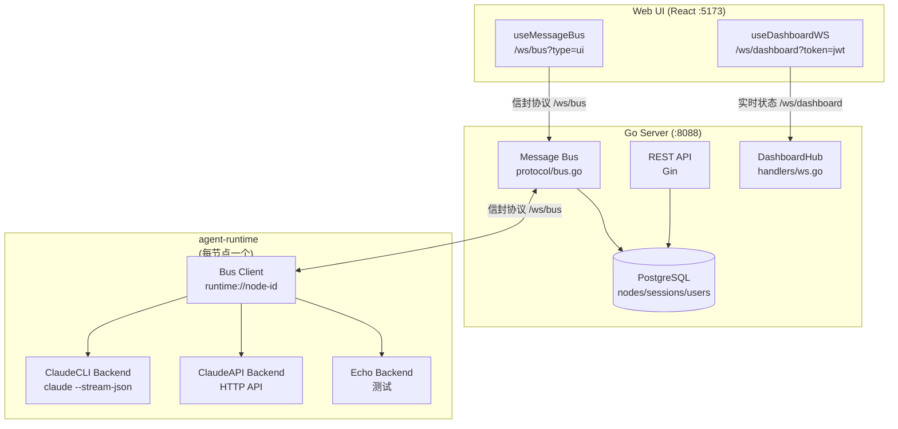
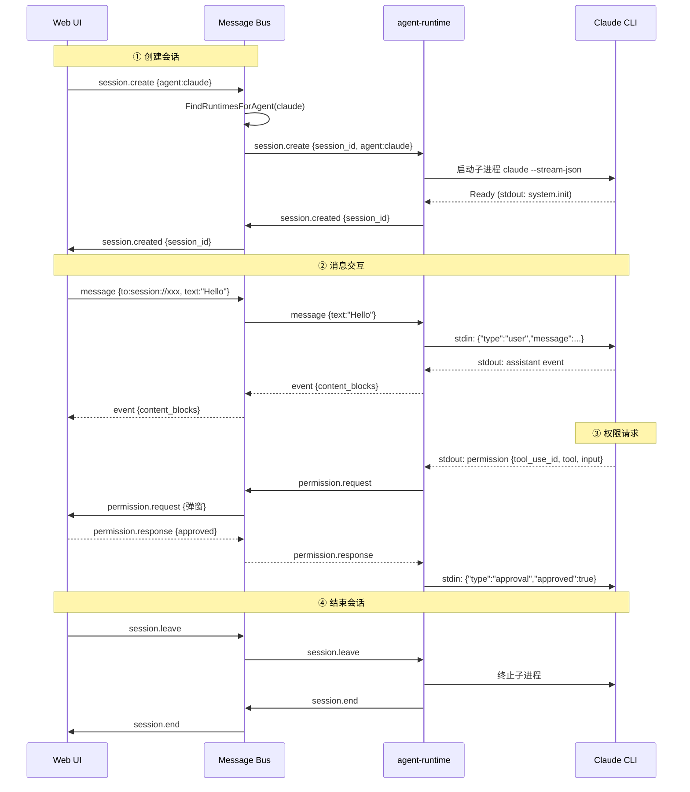
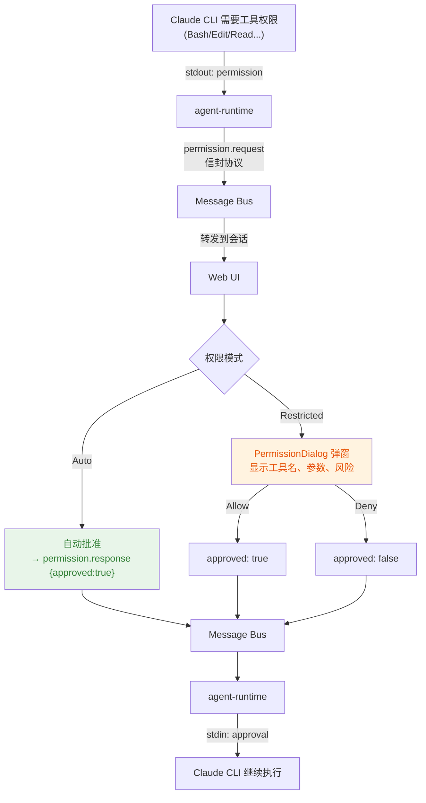
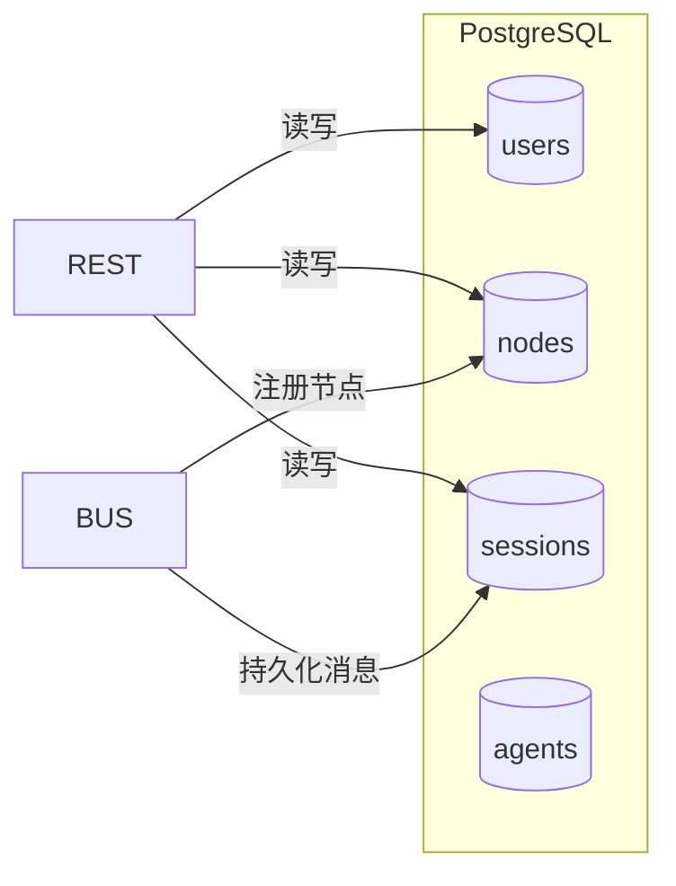
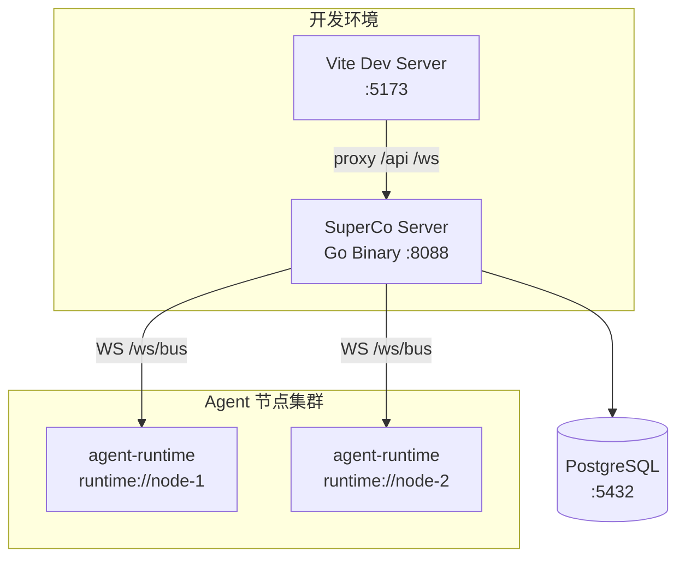

# SuperCo 当前架构流程图

> 版本: 2026-06-01
> 说明: 本文档使用 Mermaid 流程图描述 SuperCo 当前（agent-runtime + Message Bus）架构

---

## 一、系统架构总览



---

## 二、组件通信方式

| 组件 | 连接方式 | 地址 |
|------|---------|------|
| Web UI → Server | WebSocket `/ws/bus?type=ui&user_id=xxx` | `ui://<user>/<conn>` |
| Web UI → Server | WebSocket `/ws/dashboard?token=jwt` | — |
| Web UI → Server | HTTP REST `/api/*` | — |
| agent-runtime → Server | WebSocket `/ws/bus?type=runtime` | `runtime://<node>` |

---

## 三、信封协议 (Envelope)

所有通信使用统一信封格式：

```json
{
  "id":        "msg_01HXYZ",
  "from":      "ui://user1/c1",
  "to":        "session://sess_abc",
  "type":      "message",
  "session_id":"sess_abc",
  "payload": {
    "content": [
      { "type": "text", "content": "Hello" }
    ]
  },
  "timestamp": 1717200000
}
```

### 地址系统

| 地址格式 | 说明 |
|----------|------|
| `ui://<user_id>/<conn_id>` | Web UI 客户端 |
| `runtime://<node_id>` | agent-runtime 实例 |
| `session://<session_id>` | 会话（广播给所有成员） |
| `system://bus` | 总线本身 |

### 消息类型

| 分类 | 类型 |
|------|------|
| 系统 | `hello`, `bye`, `ping`, `pong`, `ack`, `error` |
| 会话 | `session.create`, `session.created`, `session.join`, `session.joined`, `session.leave`, `session.end` |
| 应用 | `message`, `command`, `event`, `tool.use`, `tool.result` |
| 权限 | `permission.request`, `permission.response` |

---

## 四、会话生命周期



---

## 五、权限审批流程



---

## 六、数据存储



---

## 七、部署结构


